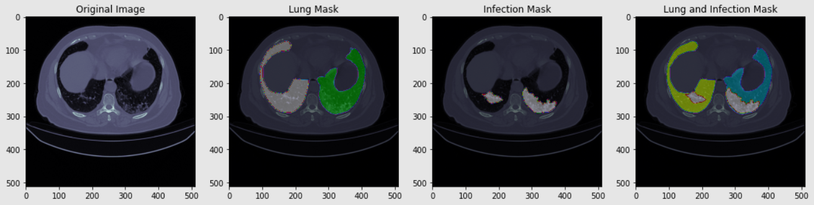
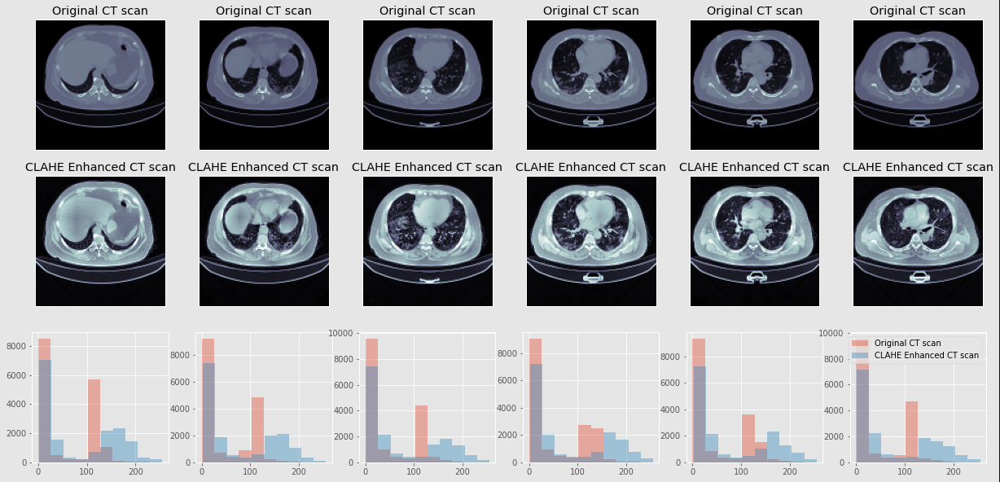
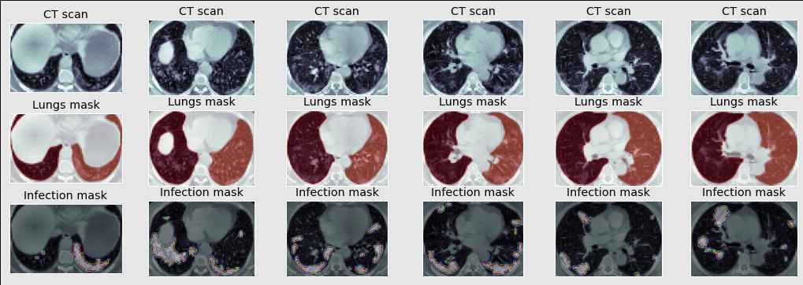
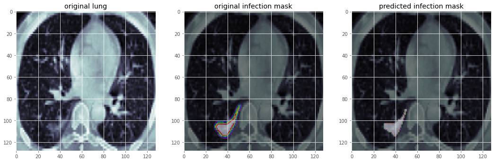

# Covid-19-lung-CTScan-segmentation

## Summary of project:
* The purpose of this project is to segment and specify parts of the lungs which are infected due to Covid-19.
* The data which I have used is from a  <a href="https://www.kaggle.com/datasets/andrewmvd/covid19-ct-scans">Kaggle paget</a>.

* For better feature extraction histogram equalization has been used, and each slice of the ct-scan has been cropped over the lungs.
* The metric by which the model has been trained with it is the sum of the weighted bce dice loss and surface loss keras.
* **UNet** is the model that has been chosen.
* The testset got the **93% for AUC**, **0.93% sensitivity**, and **0.99% specificity**.

<h3>Brief look at data</h3>
 
 
<h3>Histogram equalization</h3>
Histogram equalization has been used since this method usually increases the global contrast of many images, especially when the image is represented by a narrow range of intensity values. Histogram equalization often produces unrealistic effects in photographs; however, it is very useful for scientific images like x-ray and CT-scan.

 

<h3>Data being cropped</h3>
 
  
<h3>Result</h3>
 
 

